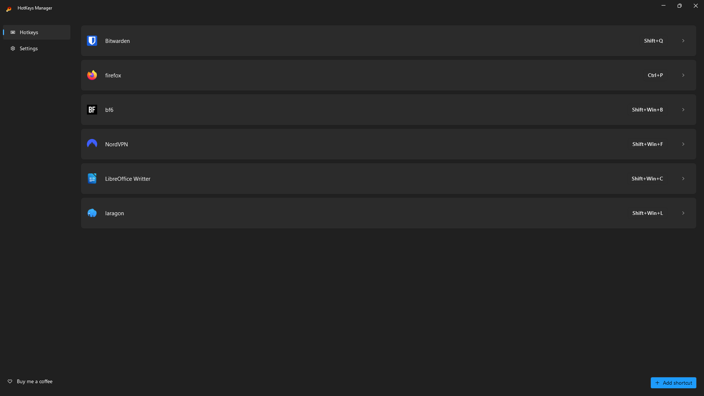
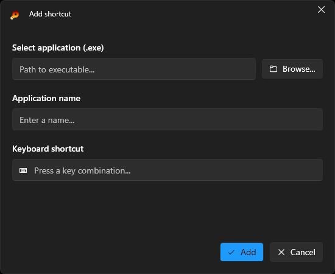

# 🔥 HotKeys Manager

> A lightweight, modern Windows application to create and manage global keyboard shortcuts (hotkeys) for launching your favorite applications instantly.

---

## ✨ Features

- 🎯 **Global Hotkeys** - Create system-wide keyboard shortcuts to launch any application
- ⌨️ **Full Key Support** - Supports Ctrl, Alt, Shift, and Windows key combinations
- 🎨 **Modern UI** - Beautiful Windows 11-style interface with Mica effects
- 🌓 **Auto Theme Detection** - Automatically adapts to Windows Light/Dark mode
- 🔔 **System Tray Integration** - Runs silently in the background
- 📝 **Easy Management** - Add, edit, and delete shortcuts with a few clicks
- 🚀 **Lightweight** - Only ~5 MB, minimal resource usage
- 💾 **Persistent Storage** - Your shortcuts are saved and loaded automatically

---

## 📸 Screenshots

### Main Window

### Add/Edit Shortcut Dialog

---

## 📦 Installation

You need to install **.NET 8.0 Desktop Runtime**:

1. Download from: [.NET 8.0 Download](https://dotnet.microsoft.com/download/dotnet/8.0)
2. Click on **"x64 Windows Installer"** under **.NET Desktop Runtime 8.0.xx**
3. Install [Release](https://github.com/Harlox/Hotkeys-Manager/releases) and restart Hotkeys-Manager
